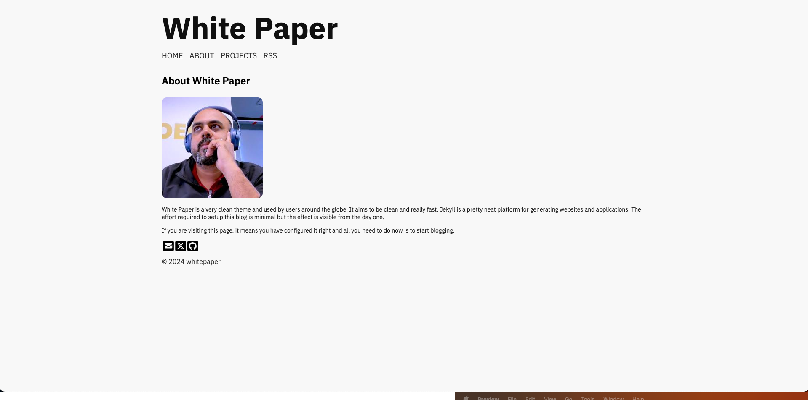

# White Paper

**White Paper** is a theme for Jekyll. It is made keeping content in focus and is best for writers/developers who also like to share code with their essays.

## Create blog posts

`jekyll-compose` gem is now installed with jekyll so now creating a new post is as easy as running this simple command

```
# ensure all the required bundles are installed
bundle install
bundle exec jekyll post "Tooling Considered Harmful"

Configuration file: /Users/vinitkumar/projects/vinitkumar.github.com/_config.yml
New post created at _posts/2019-03-06-tooling-considered-harmful.md

$ git status

Untracked files:
  (use "git add <file>..." to include in what will be committed)

  _posts/2019-03-06-tooling-considered-harmful.md
```

## White Paper in Action

#### Blog Page


#### Detail Page


#### About Page




## How to use White Paper

Fork the repo to your account by clicking the button on the top right as shown in the image:

 and then where you want to fork it as shown below.

Next, Go the the project settings and change the repository name to `<username>.github.io` where username is your username.

Change these entries in the `_config.yml` file:

Also, change this line in head.html [link](https://github.com/vinitkumar/white-paper/blob/9ad021a8f94c6240351bd57eda301b5f207e554e/_includes/head.html#L28)

```html
<!-- From this -->
<link rel="stylesheet" href=" {{ '/css/main.min.css' | relative_url }}" type="text/css" />
<!-- To this -->
<link rel="stylesheet" href=" {{ '/css/main.min.css' | absolute_url }}" type="text/css" />

```


This will make sure that the path of CSS is correct and the theme loads correctly.

```yml
master_repo: false
url: "<username>.github.io"
rtl: false  # change to true if posts is in Arabic/other Right to left language.
```
Also, change all other fields in the `_config.yml` file to your choice.

## Installation

### Local Development

This theme requires you to install couple of tools first to setup jekyll locally.

```$
git clone git@github.com:vinitkumar/white-paper.git

# If you have ruby installed.
gem install jekyll bundler

# If you have node installed.
npm install
sudo npm install -g grunt-cli  #to get the task runner for grunt.
bundle install
jekyll serve

# on running the serve script, the site will be live on
http://127.0.0.1:4000
```
This theme uses grunt to concat & minify the css for best performance. In order to prepare the css build. Run `grunt`
It will create a main.min.css file in the css folder.

### Switch Syntax Highlighting.

This theme also provides syntax highlighting in different theme. Inside css folder, there is a syntax folder.

```$
.
├── emacs.css
├── github.css
├── monokai.css
├── native.css
├── syntax.css
└── vim.css

```

Now in the gruntfiles.js

```js
concat: {
  dist: {
    src: [
      'css/base.css',
      'css/sytax/emacs.css', // change this to another theme if you prefer, like vim.css and run grunt
      'css/octicons.css'
    ],
    dest: 'css/<%= pkg.name %>.add.css'
  }
}
```

## Contributors

### Code Contributors

This project exists thanks to all the people who contribute. [[Contribute](CONTRIBUTING.md)].
<a href="https://github.com/vinitkumar/white-paper/graphs/contributors"></a>

#### Organizations

Support this project with your organization. Your logo will show up here with a link to your website. [[Contribute](https://opencollective.com/whitepaper/contribute)]

<a href="https://opencollective.com/whitepaper/organization/0/website"></a>
<a href="https://opencollective.com/whitepaper/organization/1/website"></a>
<a href="https://opencollective.com/whitepaper/organization/2/website"></a>
<a href="https://opencollective.com/whitepaper/organization/3/website"></a>
<a href="https://opencollective.com/whitepaper/organization/4/website"></a>
<a href="https://opencollective.com/whitepaper/organization/5/website"></a>
<a href="https://opencollective.com/whitepaper/organization/6/website"></a>
<a href="https://opencollective.com/whitepaper/organization/7/website"></a>
<a href="https://opencollective.com/whitepaper/organization/8/website"></a>
<a href="https://opencollective.com/whitepaper/organization/9/website"></a>

## License
* see [LICENSE](https://github.com/vinitkumar/white-paper/blob/gh-pages/LICENSE) file


## Version
* Version 5.0.0

## Contact
#### Developer

* Homepage: http://vinitkumar.me
* e-mail: mail@vinitkumar.me
* Twitter: [@vinitkme](https://twitter.com/vinitkme "vinitkme on twitter")
